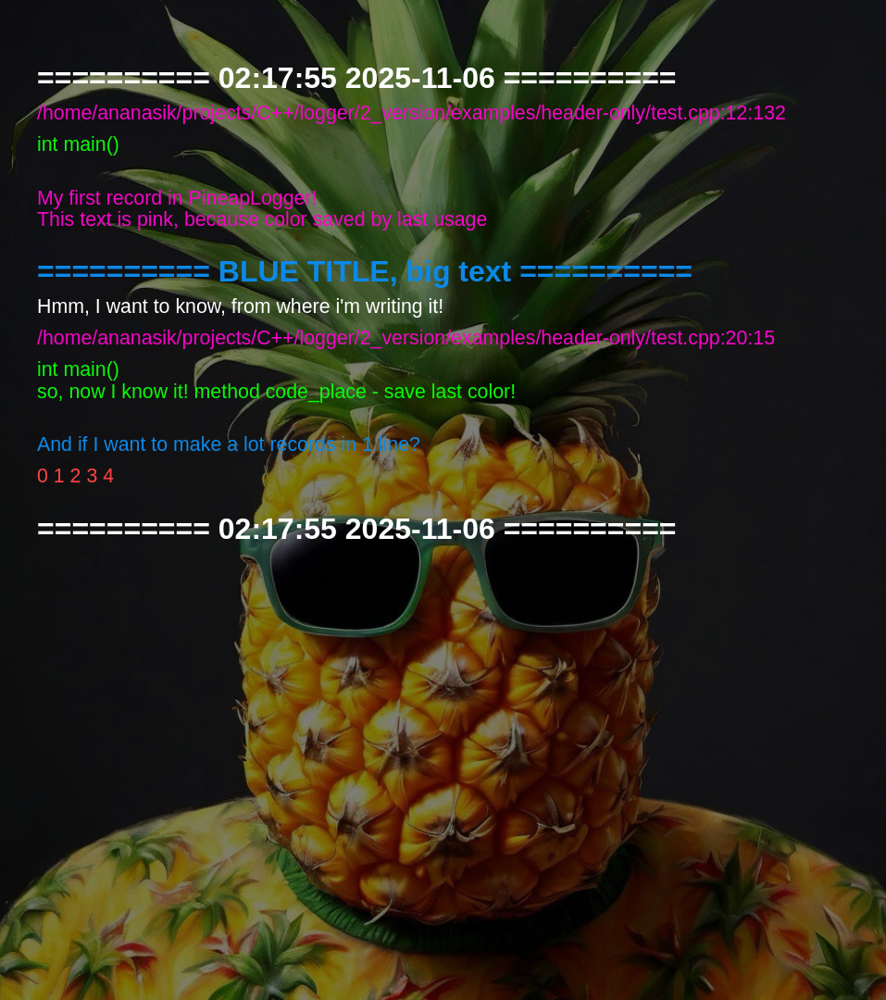

# PineapLog 🍍

## Описание:
В данном проекте реализован простейший логгер для логирования в `.html` файлы.

Предоставлены 2 версии логгера:
1) header-only библиотека
2) Модульная реализация .cppm (C++23)

Для просторы использования рекомендуется header-only реализация, а для максимальной производительности и независимости от типа сборки основного проекта - модульная.

## Установка:

```bash
git clone https://github.com/Maksim-Sebelev/logger.git
cd logger
```

## Как подключить к вашему проекту:

Для git-репозиториев рекомендуется добавить проект как submodule:
```bash
git submodule add https://github.com/Maksim-Sebelev/logger.git third-party/PineapLog
```

Для header-only библиотеки достаточно передать путь `Src/header-only/` для подключения хедера и внутри проекта подключать логгер:
```cpp
/* в вашем проекте */
#include "pineaplog.hpp"
```

и в `cmake`:
```cmake
target_include_directories(<your target 1>
    PRIVATE
        /path/to/logger
)

target_include_directories(<your target 2>
    PRIVATE
        /path/to/logger
)

# ...
```

Для модульной реализации используйте `add_subdirectory` в вашем cmake, и не забывайте линковать в Вашим таргетам логгер:
```cmake
# добавляем проект в ваш основной:
add_subdirectory(/path/to/module-based/version)

# линкуем к нужным таргетам:
target_link_libraries(<your target 1>
    PRIVATE
        pineaplog_mb
)

target_link_libraries(<your target 2>
    PRIVATE
        pineaplog_mb
)

# ...
```

Внутри файлов, где хотите использовать логгер используйте:
```cpp
import pineaplog;
```

## Использование:

Все происходит внутри `namespace PineapLog` и `class Logger`.

Вот все методы:

```cpp
template <typename... Args>
void log                  (                       const Args&... args);
template <typename... Args>
void logc                 (const LogColor& color, const Args&... args);

void logc_in_line_begin   (const LogColor& color = LogColor::White);
void log_in_line_begin    ();
template <typename... Args>
void log_in_line          (                       const Args&... args);
void log_in_line_end      ();

void title                (const std::string& title, LogColor color = LogColor::White);

void code_place           (const std::source_location& location = std::source_location::current());

void set_color            (const LogColor& color);

void log_endl             ();

void log_image            (std::string_view path_to_image, std::string_view description = "");
```

Вот все конструкторы для `class Logger`:
```cpp
// default ctor. background type = plain
Logger(const std::string& logger_file_name,                                     bool need_log_call_place = false, const std::source_location& location = std::source_location::current());
Logger(                                                                         bool need_log_call_place = false, const std::source_location& location = std::source_location::current()); // same ctor, but with default name

// ctor with choice of background type. BUT here you cant to choose image on background
Logger(const std::string& logger_file_name, const LoggerBackground& background, bool need_log_call_place = false, const std::source_location& location = std::source_location::current());
Logger(                                     const LoggerBackground& background, bool need_log_call_place = false, const std::source_location& location = std::source_location::current()); // same ctor, but with default name

// ctor for background with image
Logger(const std::string& logger_file_name, std::string_view path_to_image,     bool need_log_call_place = false, const std::source_location& location = std::source_location::current());
Logger(const LoggerBackground&  background, std::string_view path_to_image,     bool need_log_call_place = false, const std::source_location& location = std::source_location::current()); // same ctor, but with default name

// dtor
~Logger();

// rule of 5 (redefine default dtor)
// not allowed to copy logger
Logger           (const Logger&)  = delete;
Logger& operator=(const Logger&)  = delete;

// not allowed to move logger
Logger           (const Logger&&) = delete;
        Logger& operator=(const Logger&&) = delete;
```

Так же предоставлена глобальная переменная:
```cpp
PineapLog::Logger glog; /* glog = global logger */
```
Здесь она является аналогом `std::cout` для `iostream`, только `glog` НЕ буфферезирован.

Примеры использования:

```cpp
PineapLogger::Logger log("my-first-logger", "my-background-image.png", true);
log.logc(LogColor::Pink, "My first record in PineapLogger!");

log.log("This text is pink, because color saved by last usage");

log.title(LogColor::Blue, "BLUE TITLE, big text");

log.logc(LogColor::White, "Hmm, I want to know, from where i'm writing it!");
log.code_place();
log.log("so, now I know it!. method code_place - save last color!");

log.log_endl("Now I want to skip line in html");

log.log("I have an image my-insert-image.jpg, i want to insert it in html");
log.log_image("my-insert-image.jpg", "Sure!");

log.log(LogColor::Blue, "And if I want to make a lot records in 1 line?");
log.log_in_line_begin(LogColor::Red);
for (int i = 0; i < 5; i++)
    log.log_in_line(i, " ");
log.in_line_end();
```
Если довериться моему выбору картинок, то получится что-то в духе:




